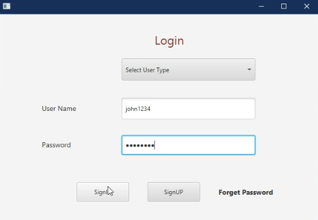
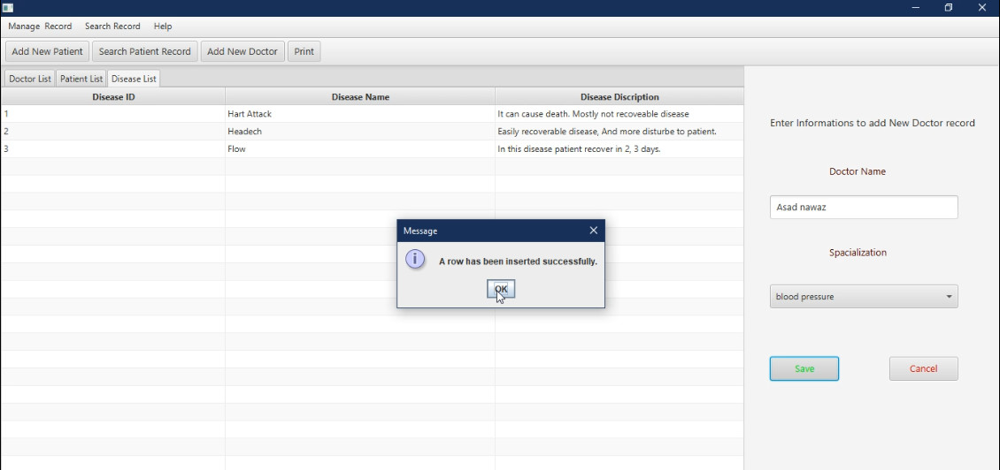
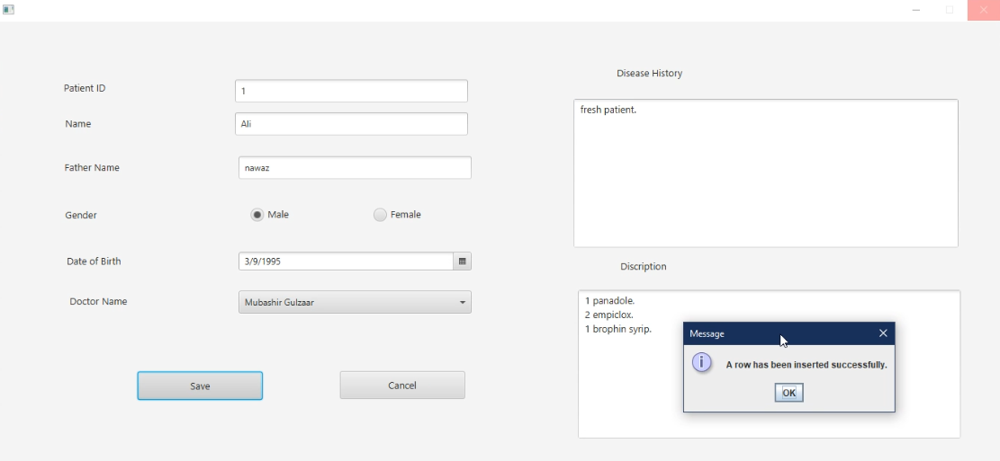
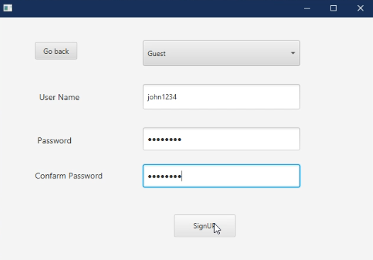

# Patient-Managment-System-in-java-FX

This project is Developed in pure java language and java FX technologies. 
Front-end developed in java FXML and back-end debveloped in java lnguage. And mySQL database is used to store data.

<h3>Features</h3>

<ul>
<li>Multipal Users of system (Admin, Guest, computer operator etc).</li>
<li>admin can Manage Doctor records. </li>
<li>computer operator can manage Patient and disease records.</li></ul>

<h3>Screen shorts</h3>
  
  Login
  

 
 Add new Doctor.
 
 
 
 Insert a new Patient.
 
 

Create a new user

